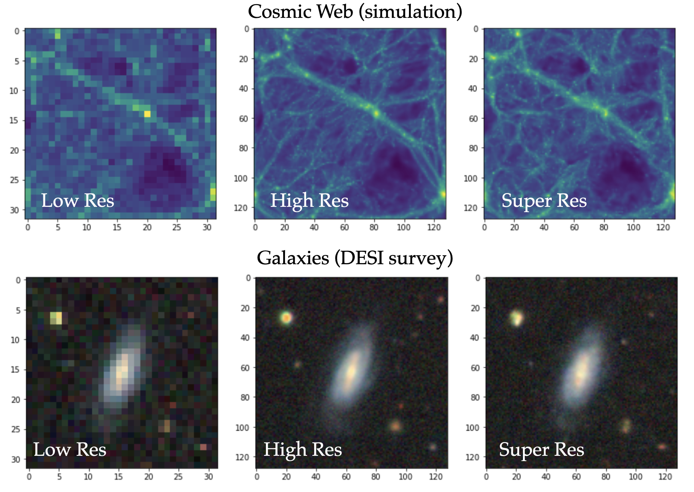

# IAIFI Astro Hackathon: Super Resolution 

These notebooks are a starting point for hacking on the super resolution (SR) task for the IAIFI Astro Hackthon.

- [Notebook 1](./notebooks/Part1_DataSet.ipynb): Data description and exploration.
- [Notebook 2](./notebooks/Part2_GenerativeSR.ipynb): Building and training the SR model (using diffusion models).

